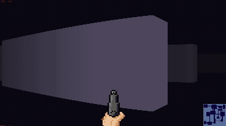

# Wolfenstein-Renderer-Win

A copy of the smart ahh Wolfenstein renderer (2d -> apparent 3D using ray-casting)

After adding a minimap and smoothing player input

Added sounds and wall types

Added shooting! no way!

### Gameplay demo with sound, click the gif:)
